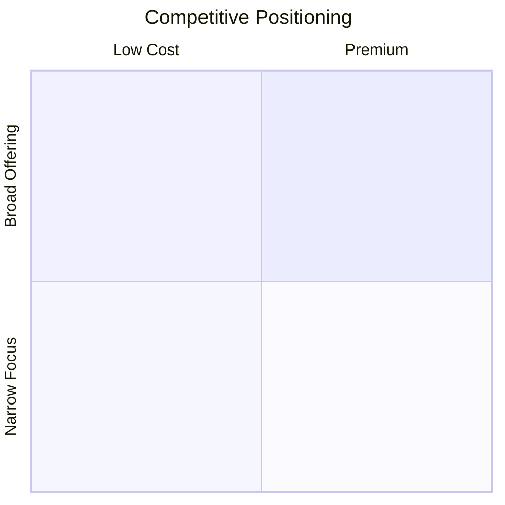

# Methodology Reference

## Output Template

```markdown
# Competitive Analysis: {PRODUCT} in {MARKET}

**Date**: {date} | **Analyst**: Claude | **Input quality**: {thin|moderate|rich}

## Competitors

| Name | Type | Target Segment | Business Model | UVP | Moat | Trajectory | Confidence |
|------|------|----------------|----------------|-----|------|------------|------------|
| ... | direct/indirect/adjacent/substitute | ... | ... | ... | ... | ↗️/→/↘️/🆕 | high/med/low |

## Feature Matrix

| Feature | {Product} | {Comp1} | {Comp2} | {Comp3} |
|---------|-----------|---------|---------|---------|
| ... | ✅/❌/🟡 | ... | ... | ... |

> 🟡 = partial or planned

## Positioning

Optional Mermaid quadrant (adapt axes to industry):


Or narrative positioning analysis if data insufficient for quadrant.

## Kill-Criteria Check

| Criterion | Threshold | Finding | Signal |
|-----------|-----------|---------|--------|
| Market saturation | >5 funded direct competitors | ... | 🟢/🟡/🔴 |
| Price/margin pressure | Race to bottom or commoditization | ... | 🟢/🟡/🔴 |
| Offering parity | >80% overlap with leader | ... | 🟢/🟡/🔴 |
| Switching cost | Low barrier = high churn risk | ... | 🟢/🟡/🔴 |
| Resource gap | Competitor outspends >10x | ... | 🟢/🟡/🔴 |

**Verdict**: {GO / CONDITIONAL GO / NO-GO} — {one-line rationale}

> Any 🔴 = explicit kill recommendation with reasoning.

## Gaps & Opportunities

- Where target product can differentiate
- Underserved segments competitors ignore
- Pricing/positioning white space

## Sources

- {numbered source list with URLs and access dates}
```

## Optional Frameworks

Apply only when the trigger condition is met. Skip silently otherwise.

### Market Timing (VC / Blue Ocean)

**Trigger**: Evaluating a new market entry, pivot, or "should we build this?" decision.

Add to output after Positioning section:

```markdown
## Market Timing

| Dimension | Assessment |
|-----------|-----------|
| Stage | [emerging / growth / mature / declining] |
| Trigger event | [what changed that creates an opening now?] |
| Window | [how long before window closes?] |
| "Why Now" | [one-line: why this market, this moment] |
```

### Trajectory (BCG / Gartner / CI)

**Trigger**: Time-series signals are available (funding rounds, hiring, product launches, review trends). Always include Trajectory column in Competitors table when any signal is available.

Trajectory values for Competitors table:
- ↗️ accelerating — recent funding, hiring surge, frequent releases
- → steady — stable team, regular but unremarkable updates
- ↘️ declining — layoffs, stale product, negative review trend
- 🆕 new entrant — <2 years, trajectory unclear

### ERRC Grid (Blue Ocean Strategy Canvas)

**Trigger**: >3 direct competitors exist AND user needs differentiation strategy (not just landscape scan).

Add to Gaps & Opportunities section:

```markdown
### ERRC — Differentiation Levers

| Eliminate | Reduce | Raise | Create |
|-----------|--------|-------|--------|
| [over-served factors to skip] | [where to undercut] | [where to exceed leaders] | [what nobody offers yet] |
```

### Entry Barriers (Porter's Five Forces)

**Trigger**: Assessing market entry feasibility — new venture, new market, or pivot.

Add to Kill-Criteria Check section as additional row:

```markdown
| Entry barriers | [capital / regulatory / technical / network-effects / data-moat] | [assessment] | 🟢/🟡/🔴 |
```

Barrier types to assess:
- **Capital**: minimum investment to compete
- **Regulatory**: licenses, certifications, compliance
- **Technical**: IP, patents, proprietary tech
- **Network effects**: value scales with user base
- **Data moat**: data advantage compounds over time

---

## Industry Sources

Adapt source selection to industry and geography. Examples by category:

**Software/SaaS**: G2, Capterra, AppVizer (FR), Trustpilot, ProductHunt, SimilarWeb
**Physical products**: Amazon reviews, trade publications, industry associations
**Services/consulting**: Clutch, LinkedIn, industry directories, conference lists
**Finance/fintech**: Crunchbase, PitchBook, regulatory filings
**General**: Glassdoor (team size signals), Crunchbase (funding), SimilarWeb (traffic)

**FR market add-ons** (when geography is France):

| Source | What |
|--------|------|
| AppVizer | Software reviews + comparisons (FR focus) |
| Capterra.fr | User reviews + feature comparison |
| Trustpilot.fr | Customer satisfaction scores |
| INSEE | Market size data (France) |
| Sirene / Societe.com | Company registry, financials |

## Perplexity Deep Search Prompt

Always append this at the end of the output, with variables filled from analysis:

```
---
🔍 PERPLEXITY DEEP SEARCH — copy into perplexity.ai (Pro deep research mode)
---

You are a competitive analyst for a product/service targeting {SEGMENT} in {MARKET}.

Product: {PRODUCT_NAME}
Category: {CATEGORY}
Competitors identified so far: {COMPETITOR_LIST}

Research:

1. **Competitor deep dive** — for each competitor:
   - Current pricing (exact tiers)
   - Feature changelog (last 12 months)
   - Customer reviews (use industry-appropriate sources from analysis)
   - Team size, funding, revenue estimates
   - SEO traffic estimates (SimilarWeb, SEMrush)

2. **Missing competitors**:
   - Search: "{CATEGORY} {MARKET} alternatives"
   - Search: "{CATEGORY} pour {SEGMENT}" (if FR market)
   - Check: ProductHunt, AppSumo, IndieHackers for new entrants

3. **Market signals**:
   - Google Trends for category keywords (2 years)
   - Reddit/forum sentiment
   - Regulatory changes

4. **Pricing/business model intelligence**:
   - Price sensitivity (customer complaints, willingness to pay)
   - Business model benchmarks for category

Output as structured markdown with sources for every claim.
```

## Upgrade Path

Future enhancements (not implemented):
- **File convention**: If `analysis/perplexity-enrichment.md` exists, incorporate as enrichment source
- **Sub-agents**: When MCP web search is available, spawn parallel research agents per competitor
- **Hypothesis registry**: Link kill-criteria findings to H-DEMAND hypothesis tracking
